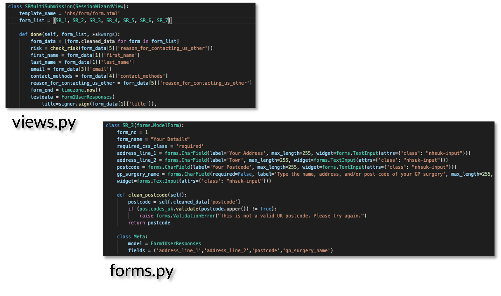
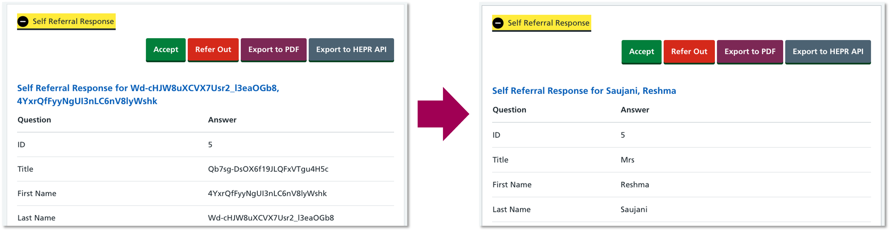
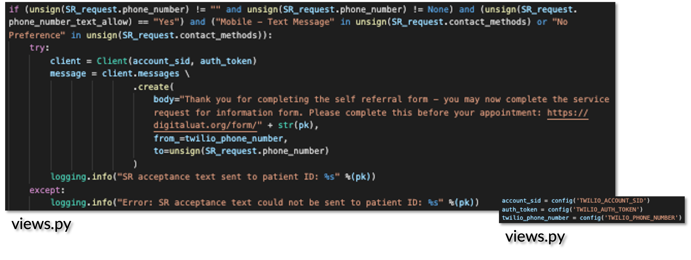

# A note from the creator

"For my masters dissertation, I collaborated with the NHS in the UK to develop a mental health electronic patient record system and self referal form. **As my code now belongs to the NHS after submitting this project in September 2021, I am not permitted to publish my code publically.** As such, I have provided the `README` from the original (private) NHS repository below, with several code snippets near the bottom. If you would like to see more code snippets or see a live demonstration, please email me using my contact details at the bottom of this page."

# Single Point of Access (SPA)

## Caroline Crandell - MSc Computer Science IXN Dissertation in partnership with the NHS (UK)


Find the full demo here on [YouTube](https://www.youtube.com/watch?v=prh2AlRaXaY).

**What does this application do and why?**

The SPA application comprises of a self referral (SR) and service request for information (SRI) form for patients to complete to access mental health services in the UK through the NHS. It also provides a portal for clinicians to view patient responses, equipping clinicians with the appropriate data and enabling them to contact patients accordingly. The goals of the application are to:

- Reduce patient waiting times between form submission and contact from a clinician
- Implement a friendly and familiar user experience for patients and clinicians
- Provide an accessible application for clinicians to tailor to their own practice


Through this application, clinicians are able to:

- Receive emails regarding patient SR and SRI form submissions, including necessary information such as high-risk cases
- View all patient submissions in the main portal
- View the SR and SRI responses for individual patients
- Send a text/email to individual patients, requesting they complete the SRI form
- Download the SR and SRI responses for each individual patient in PDF form

Patients are able to:

- Complete the SR and SRI forms, equipped with functionality to determine if the patient is high-risk
- Receive email confirmations of receipt for the SR and SRI forms
- Receive requested information on services depending on their preferences specified in the form(s)
- Receive a text/email prompting them to complete the SRI form after completing the SR form

**How the application is organised**

The SPA application is divided into the following folders:

- **images folder** - contains images for this README document
- **mysite folder** - contains the fundamental code used to run the SPA application (including settings.py)
- **nhs folder** - contains the static files, database structure, and functionality of the NHS forms and clinician portal
- **static folder** - contains the static files, which includes all CSS and JavaScript files
- **.dockerignore** - document that indicates which files to omit from the Docker container
- **.gitignore** - document that indicates which files to omit from the GitHub repository, such as the myvenv folder and the environment variables (i.e., passwords stored in the .env file)
- **Caddyfile** - contains reverse proxy needed for Linux server
- **docker-compose.yml** - contains instructions for building a Docker container
- **Dockerfile** - contains instructions for creating a Docker image
- **emails.py** - contains the formatting for the NHS emails to be sent to patients and clinicians
- **manage.py file** - contains the code to run the SPA application
- **README** - this document, providing background information for the application
- **requirements.txt** - contains the instructions of which packages to install when creating a new virtual environment
- **script.js** - contains the code to conduct stress testing on the SPA application
- **myvenv folder** - (in the .gitignore) contains the packages and virtual environment to run the SPA application
- **db.sqlite3** - (in the .gitignore) the database file
- **signer.py file** - (in the .gitignore) generates and stores the key to sign and unsign data sent to and from the database
- **SPA.log** - (in the .gitignore) the log to document notable events that occur when users interact with the SPA application

**Step-by-Step on how to run the application**

First clone this application repository on to your computer. Open your terminal and navigate to where you would like to download the source code. Then for SSH, type:

```js
git clone git@github.com:cecrandell/nhs.git
```

Or for HTTPS, type:

```js
git clone https://github.com/cecrandell/nhs.git
```

Now that you have downloaded the application on to your computer, please ensure that you have [Python3 installed](https://realpython.com/installing-python/) on your computer. Then navigate to the root folder in your terminal and create a new virtual environment:

```js
python3 -m venv myvenv
```

After installation, please activate your virtual environment:

```js
source myvenv/bin/activate
```

Now ensure that the latest version of pip is installed in your virtual environment:

```js
python -m pip install --upgrade pip
```

After downloading/upgrading pip, please install Django and other relevant packages in your virtual environment:

```js
pip install -r requirements.txt
```

In the mysite folder in the root folder of the repository, create a .env file that provides the following passwords:


All login details should be customized to your accounts, however, to acquire the Django Secret Key, please contact the developer (contact details below). After all login details are configured, please create a signer.py file with the following contents in the root folder of the repository:


Then make migrations to initialize the database:

```js
python manage.py makemigrations
```

Then migrate the database:

```js
python manage.py migrate
```

Then create a login:

```js
python manage.py createsuperuser
```

And follow the prompts below:


You may now launch the application in your browser:

```js
python manage.py runserver
```

# To Set Up Docker (Optional)

To build the Docker image:

```js
docker-compose build
```

To run the Docker container:

```js
docker-compose up -d
```

To acquire the Docker container ID:

```js
docker ps
```

Copy the Docker container ID and in a new terminal, type:

```js
docker exec -it [copied Docker container ID] /bin/sh
```

Make migrations to initialize the database within the Docker container:

```js
python manage.py makemigrations
```

Then migrate the database within the Docker container:

```js
python manage.py migrate
```

Then create a login within the Docker container:

```js
python manage.py createsuperuser
```

And follow the prompts below within the Docker container:


# Code Snippets

## Check Risk Functionality


## Docker


## Error Page Functionality


## Django Forms



## Form Templates


## jQuery Form Functionality


## Logging


## Django Models


## PDF Functionality


## PPI Encryption



## Django Step Logic


## Template Tags


## Twilio Text Messages



## Functionality


## User Authentication


**Technologies Used**

- Django
- Python
- SQLite
- HTML
- CSS
- JavaScript
- jQuery
- Twilio

**Developer**

- Caroline Crandell - cecrandell - cecrandell19@gmail.com - [LinkedIn](https://www.linkedin.com/in/carolinecrandell/)
